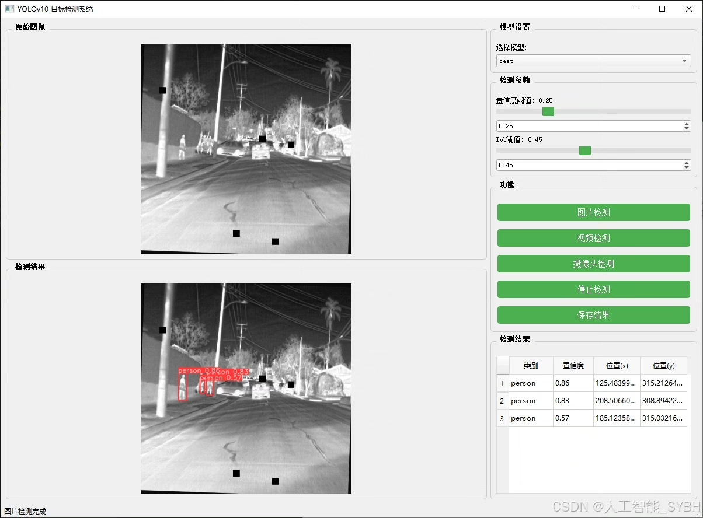
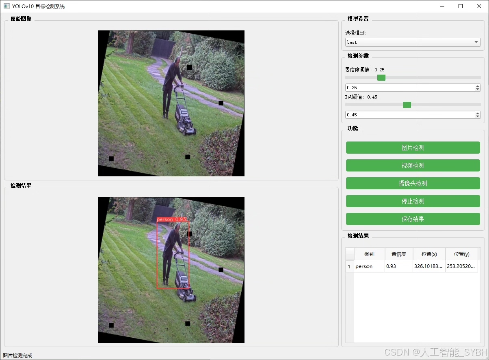
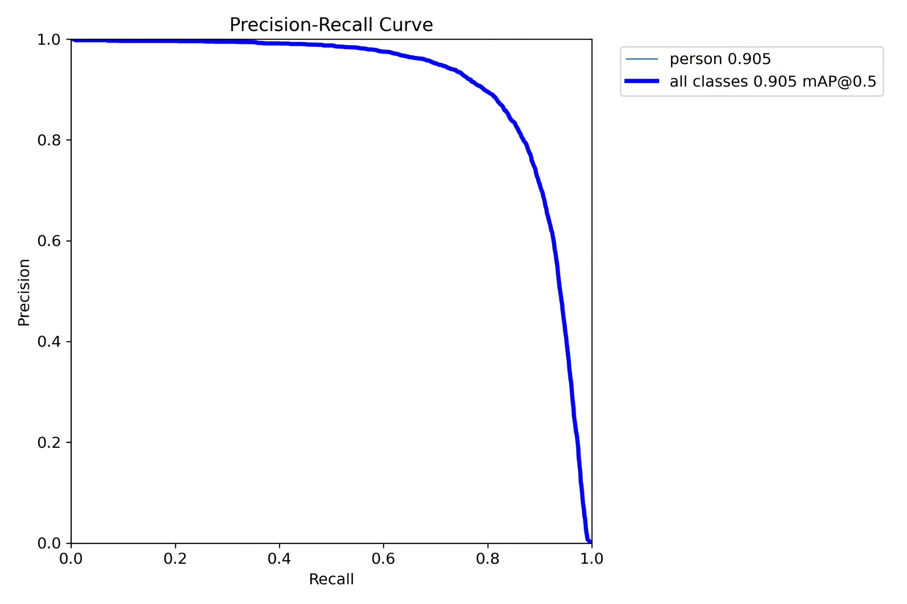
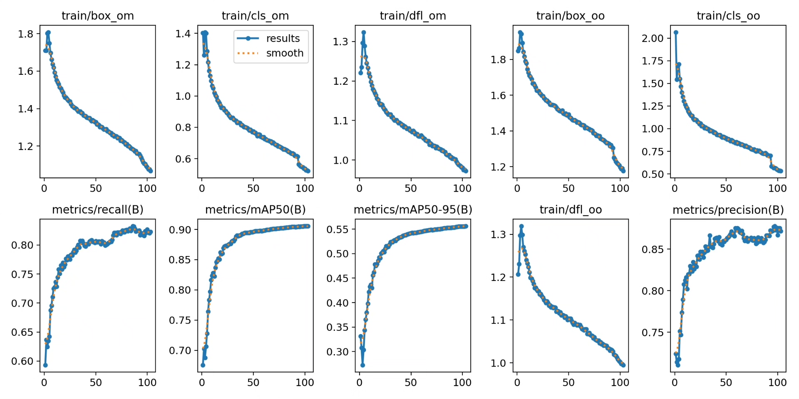
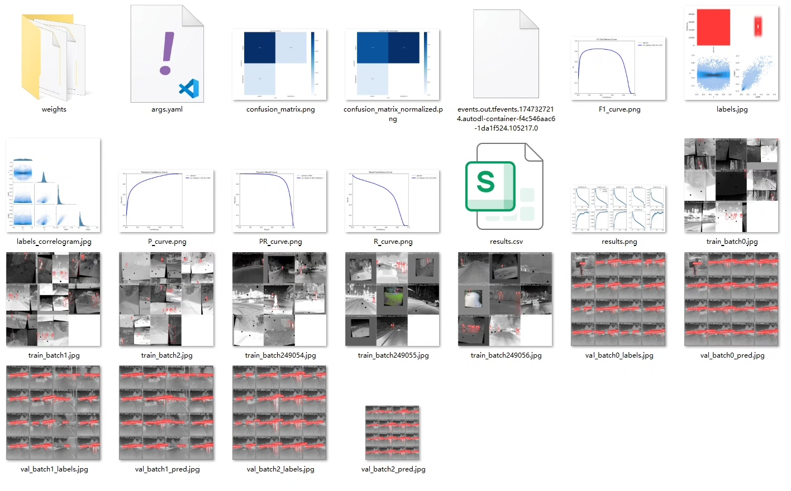
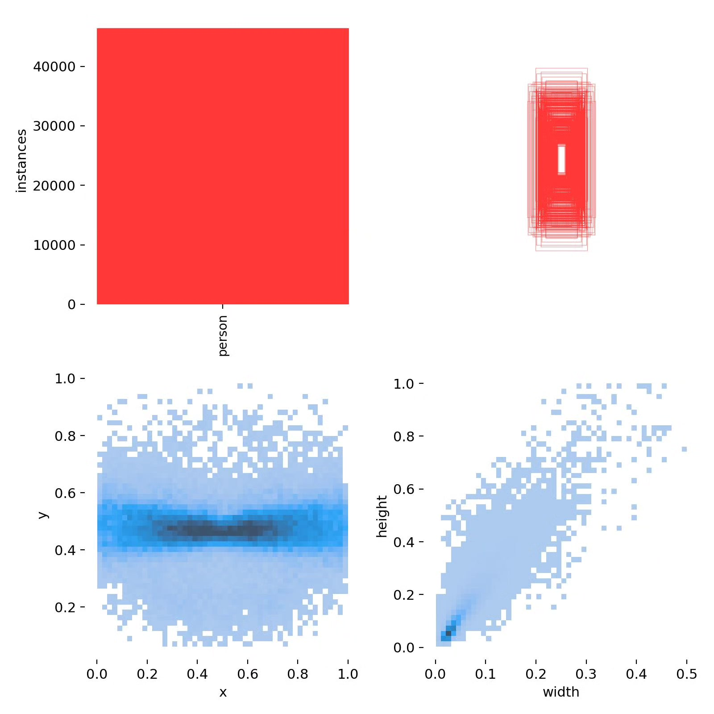
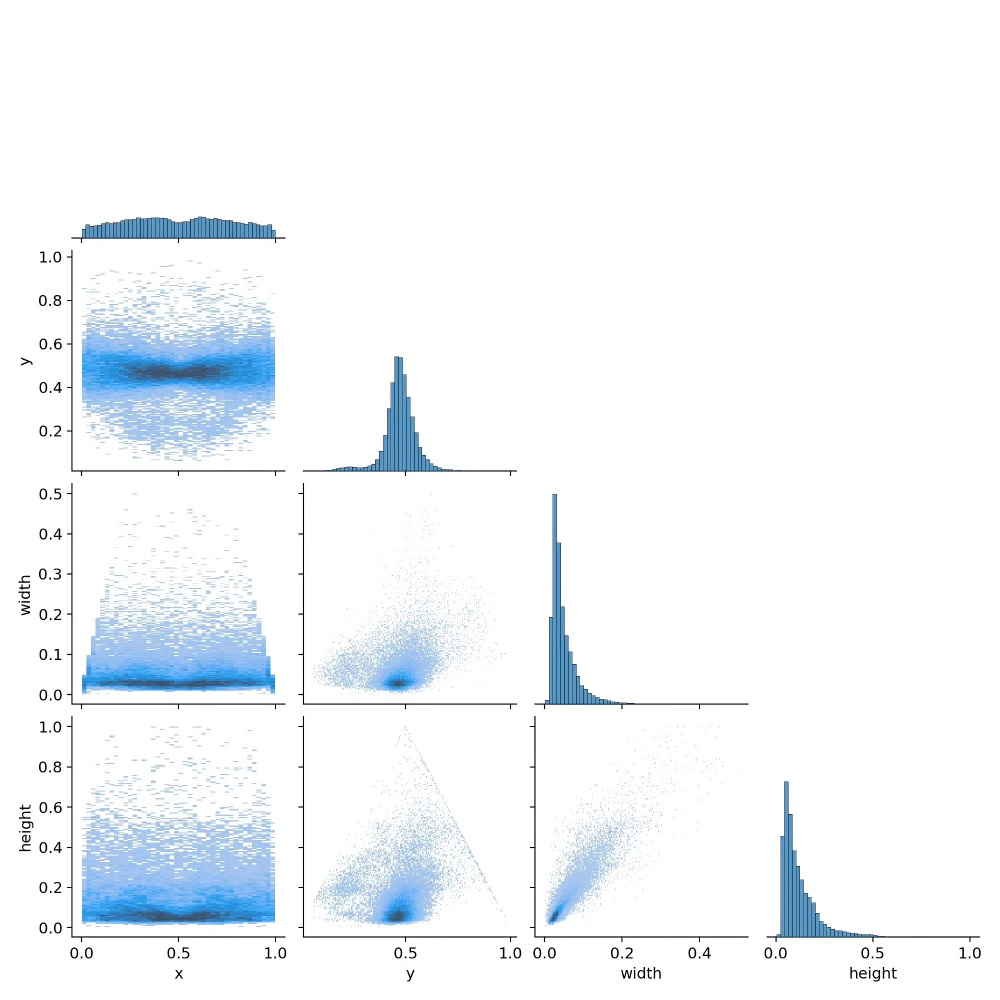
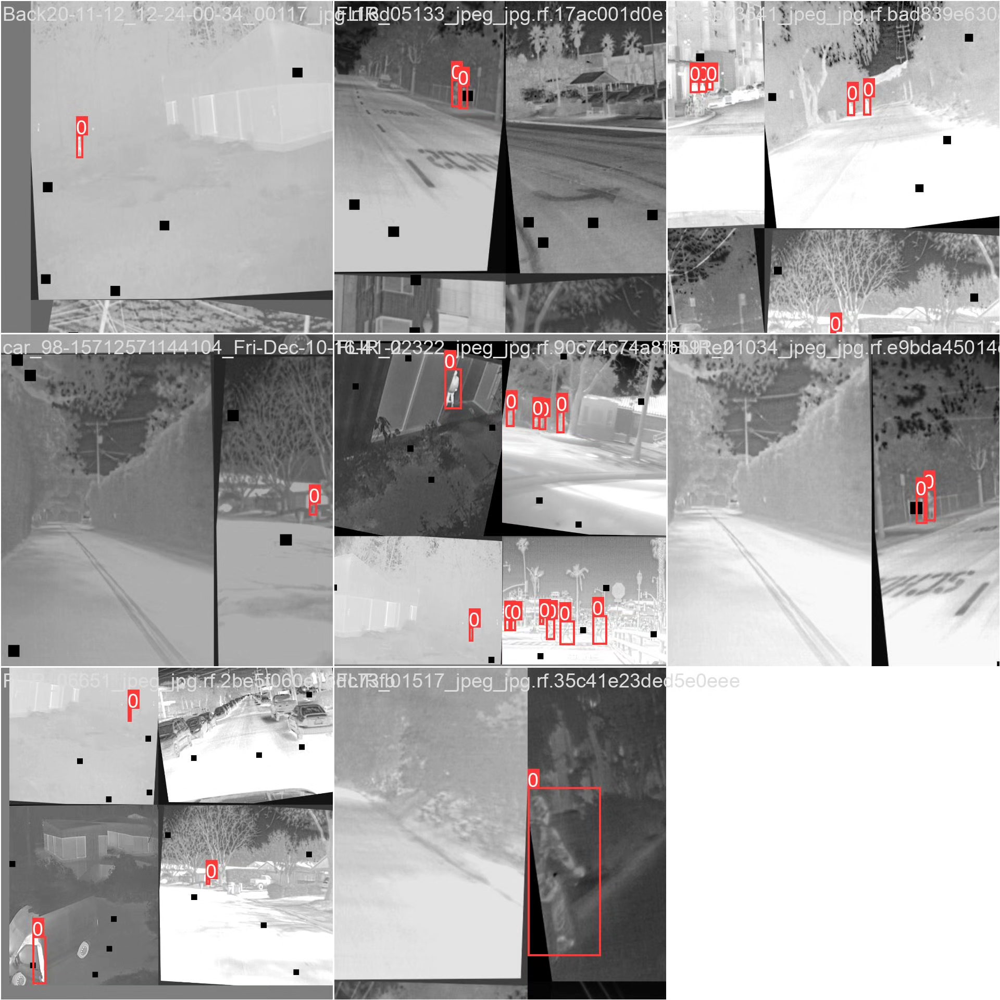

# Based on deep learning YOLOv10 for thermal imaging personnel detection system (YOLOv1)

## Body

Based on the YOLOv10 algorithm, a high-efficiency thermal imaging personnel detection system has been developed for processing tasks of person recognition and localization in thermal imaging images. The system is trained and validated using a dataset containing 26,014 thermal imaging images, with 21,422 training images, 3,061 validation images, and 1,531 test images. The system maintains high accuracy performance even under low lighting and harsh weather conditions, suitable for applications such as security monitoring, night rescue, military reconnaissance, etc. By optimizing the network structure and training strategy of YOLOv10, this system achieves higher accuracy and real-time performance in thermal imaging personnel detection tasks, providing a reliable technical solution for target detection in special environments.

The company's products have obtained the official commercial license certification from YOLO.

We provide after-sales service.

After payment, we will provide WeChat ID to answer questions anytime.

Environmental configuration: We will provide an instruction tutorial for environmental configuration, and WeChat will provide answers.

Remote installation service: If you need remote configuration, an additional fee of 69 is required.
If the configuration fails, all fees will be refunded (only the installation fee is refundable for older computers).

Retraining dataset: After configuring the environment, you can train on your own computer.
If you need us to retrain, just pay 69 + computing power fees (2.5 yuan/hour)

## Images

## Payment

Here is a pay link on Stripe ( https://buy.stripe.com/3cs8yP7sY87d0vu9AB ). Please contact me lonlonago@foxmail.com after funding $89, and I will send you a complete data files , thank you!

